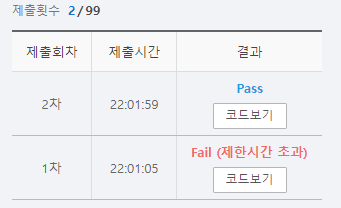

# SWEA 5188 최소합

### 문제 

https://swexpertacademy.com/main/learn/course/subjectDetail.do?courseId=AVuPDYSqAAbw5UW6&subjectId=AWUYDrI61lYDFAVT#

<hr>


### 풀이

 우측과 아래측만 이동할 수 있는 방향 좌표를 만들어 놓고 dfs 알고리즘을 사용한다.

(0,0) 시작하여 (n-1,n-1)에 도착하면 종료하며 중간합이 지금까지 구해진 최솟값을 초과하면 함수를 바로 종료시킨다.

<hr>


### 코드

```python
import sys
sys.stdin = open('input.txt')

T = int(input())
d = [(0,1),(1,0)]

def dfs(row, col, cnt, last_row, last_col):
    global min
    if cnt > min:
        return

    if row == last_row and col == last_col:
        if cnt < min:
            min = cnt
    else:
        for i in range(2):
            if 0 <= row + d[i][0] < N and 0 <= col + d[i][1] < N:
                dfs(row + d[i][0],col + d[i][1],cnt+arr[row + d[i][0]][col + d[i][1]], last_row, last_col)


for tc in range(T):
    N = int(input())

    arr = [list(map(int,input().split())) for _ in range(N)]

    last_row = last_col = N-1

    min = (N+N-1)*10
    dfs(0,0,arr[0][0],last_row,last_col)
    print(f'#{tc+1} {min}')
```

<hr>


### 결과



중간에 가지치기를 해주지 않아서 시간 초과에 걸렸다.

경우의 수가 많지 않다고 생각하여 가지를 치지 않았는데 그 부분이 문제였다.

앞으로는 웬만하면 가지를 치도록 하자!