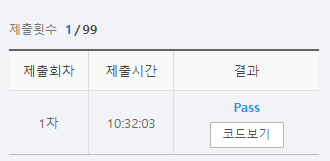

# SWEA 5189 전자키트


### 문제 

https://swexpertacademy.com/main/learn/course/subjectDetail.do?courseId=AVuPDYSqAAbw5UW6&subjectId=AWUYDrI61lYDFAVT#

<hr>

### 풀이

재귀 호출을 하며 순열을 만들어 특정 조건이 만족되면 함수를 종료시키는 백트래킹을 적용하여 풀이하였다.

순열을 담을 리스트를 생성 후 index 0, -1을 0으로 채웠다. (문제에서는 1이지만 주어진 배열의 index와 일치 시키기 위해 바꾸어줌)

이후 순열을 완성하면 값을 구한 후 현재까지 구해진 최솟값과 비교하여 업데이트 하도록 하였다.

순열은 현재 숫자를 채운 자리에는 visit이라고 방문 체크를 한 후 다음 위치의 자리로 재귀 호출을 하여 진행한다.

<hr>

### 코드

```python
import sys
sys.stdin = open('input.txt')

T = int(input())

def get_permutation(n,k):                       # n : 순열을 담을 리스트의 idx, k : 몇 개의 숫자로 순열을 만들지
    global mmin
    if n==k:                                    # 순열을 담을 리스트의 idx (n)이 k 와 같다면 해당 순열의 충전 비용 계산 후 mmin 변수 업데이트
        cost = 0
        for idx in range(N):
            cost += arr[p[idx]][p[idx+1]]
        if cost < mmin:
            mmin = cost
    else:                                       # 순열을 담을 리스트 p의 형태 [0,0,0,0],  idx 1,2 를 채워야함
        for i in range(k):                      # k개의 숫자로 순열을 만들거니까 k만큼 순회
            if visit[i] == 0:                   # 첫 번쨰 숫자를 아직 사용안했다면 사용 체크 후
                visit[i] = 1
                p[n+1] = lst[i]-1               # 순열 리스트에는 i+1 idx에 첫 번쨰 값에서 1을 뺴고 추가
                get_permutation(n+1,k)          # 순열의 다음 idx를 채우기 위해 출발
                visit[i] = 0                    # 다 채워서 순열을 완성하고 나면 함수가 종료된 후 방문 체크를 다시 0으로 변경


for tc in range(T):
    N = int(input())
    arr = [list(map(int, input().split())) for _ in range(N)]

    # 처음과 끝이 1인 순열 생성 (실제로는 idx 값을 맞춰주기 위해 편의상 양 끝을 0으로 생성)
    # N이 3이면 양 끝은 1로 고정, 그렇다면 1을 제외한 순열을 생성하면 됨 ex) [1,2,3,1] or [1,3,2,1] 즉 2부터 N까지의 값 들의 순열
    lst = list(range(2, N+1))   # 순열을 만들 값들 가져오기

    p =[0] + [0] * (N-1) +[0]   # 받아온 배열과 idx를 맞추기 시작과 끝도 1씩 뺴서 시작과 끝을 1이 아닌 0으로 변경
    visit = [0] * (N-1)         # 위에서 만든 순열을 만들 리스트의 크기 만큼 방문 체크 리스트 생성
    mmin = N*100                # 문제에서 나올 수 있는 최댓값으로 mmin 변수 초기화
    get_permutation(0, N-1)     # 순열 찾고 해당 순열의 최솟값을 찾는 함수 실행 n : 순열 리스트의 idx, N-1 : 몇 개의 값으로 순열을 만들지
    print(f'#{tc+1} {mmin}')
```

<hr>

### 결과



야호!

결과는 한 번에 성공

순열을 만드는 방법이 가장 떠올리기 어려웠다. 해당 부분을 다시 강의를 들으면서 천천히 이해할 시간이 필요할 것 같다.