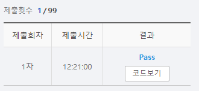

# SWEA 5201 컨테이너 운반


### 문제 

https://swexpertacademy.com/main/learn/course/subjectDetail.do?courseId=AVuPDYSqAAbw5UW6&subjectId=AWUYEGw61n8DFAVT

<hr>


### 풀이

값을 받아온 후 트럭의 값을 내림차순으로 정렬한다.

이후 트럭에서 뒤에서부터 pop 후 w를 순회하며 비교하며 truck에 담으면 해당 인덱스부터 다시 w를 순회한다.

<hr>


### 코드

```python
import sys
sys.stdin = open('input.txt')

def get_cnt(w, truck, cnt):
    idx = 0
    while truck:
        value = truck.pop()
        for i in w[idx:]:
            idx += 1
            if i <= value:
                cnt += i
                if idx == len(w):
                    return cnt
                break
    return cnt

T = int(input())

for tc in range(T):
    N, M = map(int, input().split())
    w = list(map(int, input().split()))
    truck = list(map(int, input().split()))
    if tc !=0:
        continue
    w.sort(reverse=True)
    truck.sort()
    print(w)
    print(truck)
    print(f'#{tc+1} {get_cnt(w, truck,0)}')


```

<hr>


### 결과



한 번에 성공했지만 조건을 너무 복잡하게 붙인 것 같다.

해당 부분을 더욱 깔끔하게 처리할 수 있을 것 같다.