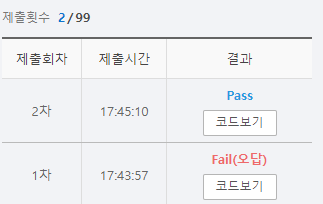

# SWEA 5203 베이비진 게임


### 문제 

https://swexpertacademy.com/main/learn/course/subjectDetail.do?courseId=AVuPDYSqAAbw5UW6&subjectId=AWUYDrI61lYDFAVT#

<hr>


### 풀이

카운팅 배열을 만들어 값을 하나 받을 때마다 triplet과 run을 확인하였다.

확인 후 승자가 나타나면 종료 시킨다.

<hr>


### 코드

```python
import sys
sys.stdin = open('input.txt')

T = int(input())

def check_run(player, i):
    if i == 0:
        if player[0] >0 and player[1] > 0 and player[2] > 0:
            return True
    elif i == 1:
        if player[0]> 0 and player[1] > 0 and player[2] > 0 or player[1] <0 and player[2] > 0 and player[3]>0:
            return True
    elif i == 9:
        if  player[9]> 0 and player[8] > 0 and player[7] > 0:
            return True
    elif i ==8:
        if player[9]> 0 and player[8] > 0 and player[7] > 0 or player[6]> 0 and player[8] > 0 and player[7] > 0:
            return True
    else:
        for j in range(i-2,i+1):
            if player[j]> 0 and player[j+1]>0 and player[j+2] >0:
                return True

def check_triplet(player,i):
    if player[i] >= 3:
        return True
    else:
        return False

for tc in range(T):
    arr = list(map(int,input().split()))

    player_1 = [0] * 10
    player_2 = [0] * 10
    for i in range(len(arr)):
        if i%2 == 0:
            player_1[arr[i]] += 1
            if check_triplet(player_1,arr[i]) or check_run(player_1,arr[i]):
                print(f'#{tc+1} {1}')
                break
        else:
            player_2[arr[i]] += 1
            if check_triplet(player_2,arr[i]) or check_run(player_2,arr[i]):
                print(f'#{tc+1} {2}')
                break
    else:
        print(f'#{tc + 1} {0}')
```

<hr>


### 결과



처음에 문제를 이해를 잘못해서 같은 값에 2개가 존재해도 triplet에 해당되는 줄 알았다.

해당 부분을 수정하였지만 아직 조건 부분이 많이 지저분함을 느꼈다. 해당 부분의 조건 처리를 조금더 간결하게 할 수 있는 방법은 생각해보아야 한다.