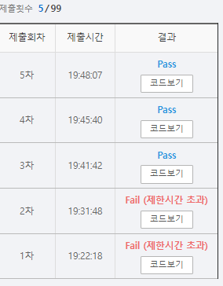

# SWEA 5204 병합 정렬


### 문제 

https://swexpertacademy.com/main/learn/course/subjectDetail.do?subjectId=AWUYFsQq11kDFAVT#

<hr>


### 풀이

병합 정렬을 이용하여 전체 길이의 가운데 값인 중간값을 기준으로 왼쪽과 오른쪽을 나누어 분할 정복을 진행한다.

재귀 호출을 통해 왼쪽을 계속해서 왼쪽과 오른쪽으로 나누어 들어가고 마찬가지로 오른쪽도 왼쪽과 오른쪽으로 나누어 들어가다가 나누어진 값의 길이가 1이 되면 병합 처리를 진행한다.

병합 과정에서는 left와 right 가 모두 존재할 때는 left의 첫 번째 값과 right의 첫 번째 값을 비교하여 작은 값을 추가하고 해당 부분을 제거한다. 이때 직접 리스트에서 제거하는 방식은 시간이 상당히 많이 소요되므로 포인터를 이용하여 직접 제거하지 않고 다음 값을 찾을 수 있도록 한다.

위 과정 후 만약 왼쪽만 남는다면 왼쪽을 전부 추가하고 함수를 종료시키며 오른쪽만 남는 경우에도 전부 오른쪽을 추가하고 함수를 종료시킨다.

<hr>


### 코드

```python
def merge(left, right):
    result = []
    # left, right 둘 중 하나라도 존재
    l_idx = 0                                   # 왼쪽 오른쪽을 포인터로 이동하자
    r_idx = 0
    l_check = len(left)                         # 중복 연산을 피하기 위해 왼쪽과 오른쪽의 길이를 미리 구해놓음
    r_check = len(right)
    while l_idx < l_check and r_idx < r_check:  
                                                # left, right 모두 존재
        if left[l_idx] < right[r_idx]:          # 왼쪽이 첫 번쨰 값이 오른쪽의 첫번째 값보다 작으면 result에 추가 후 left 포인터를 1만큼 이동
            result.append(left[l_idx])
            l_idx += 1
        else:
            result.append(right[r_idx])         # 오른쪽의 첫 번쨰 값이 왼쪽의 첫번째 값보다 작으면 result에 추가 right 포인터를 1만큼 이동
            r_idx += 1
                                                # left만 존재
    if l_idx < l_check:
        result.extend(left[l_idx:])             # 왼쪽 값을 전부 result에 추가
    else:                                       # right만 존재
        result.extend(right[r_idx:])            # 오른쪽 값을 전부 result에 추가

    return result

def merge_sort(a):  # 병합 정렬
    global cnt
    # 기본 파트
    if len(a) == 1:
        return a
    # 유도 파트
    else:
        mid = len(a)//2                     # 중간 값 찾기
        left = a[:mid]                      # 중간 값부터 왼쪽
        right = a[mid:]                     # 중간 값부터 오른쪽

        left = merge_sort(left)             # 왼쪽을 계속해서 중간 값으로 나누어서 왼쪽 오른쪽 만들기
        right = merge_sort(right)           # 오른쪽을 계속해서 중간 값으로 나누어서 왼쪽 오른쪽 만들기

        if left[-1] > right[-1]:            # 왼쪽의 마지막이 오른쪽의 마지막 보다 크면 cnt +1
            cnt += 1
        return merge(left, right)           # 합병

T = int(input())
for tc in range(T):
    N = int(input())
    cnt = 0
    arr = list(map(int, input().split()))
    arr = merge_sort(arr)

    print(f'#{tc+1} {arr[N//2]} {cnt}')
```

<hr>


### 결과



눈물이 난다...

처음 시간 초과가 발생했을 때 인덱스로 처리하지 않고 왼쪽과 오른쪽 부분을 전부 extend 로 추가해주고 함수를 종료시키면 해결될 줄 알았는데 건방진 생각이었다.

따라서 늦게라도 pop을 통한 제거를 포인터를 활용하는 방식으로 수정해주었다. 또한 더 시간을 단축하기 위해 두 개 였던 함수를 하나로 합치는 과정도 진행해보았다. 하지만 시간이 줄어드는 것에 비해 가독성 부분이 훨씬 떨어진다고 느껴서 효과적이지 않다고 생각하여 다시 함수를 두 가지로 나누었다.

기존에도 공부했던 내용이지만 append를 통해 리스트의 뒷 부분에 추가하는 것은 시간을 그리 많이 잡아먹지 않지만 pop(0)는 리스트의 모든 요소를 하나씩 앞으로 당겨야기 때문에 리스트의 크기가 커지면 시간을 엄청나게 잡아먹는다는 사실을 다시 한 번 상기시킬 수 있었다. 따라서 앞으로 pop(0)을 사용할 때 시간 관련 문제를 고려해야된다면 포인터를 바로 떠올릴 수 있도록 하자