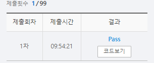

# SWEA 5205 퀵 정렬


### 문제 

https://swexpertacademy.com/main/learn/course/subjectDetail.do?courseId=AVuPDYSqAAbw5UW6&subjectId=AWUYFsQq11kDFAVT#

<hr>


### 풀이

퀵 정렬을 이용하여 정렬하는 문제이다. 

퀵 정렬 중 로무토 파티션 방식으로 진행하였다.

로무트 파티션 방식은 pivot을 항상 맨 마지막 값을 pivot으로 지정하여 사용하는 방식으로 기존 퀵 소트보다 조금 느리지만 훨씬 간결하게 작성 가능하다.

리스트의 맨 왼쪽을 left 맨 오른쪽을 pivot으로 지정 후 left에서 pivot까지를 순회하며 left와 right 포인터만 움직인다.

right의 value가 pivot보다 작다면 left와 right의 value를 교환한 후 left와 right 모두 1씩 이동한다. 만약 right의 value가 pivot보다 작다면 right만 1만큼 움직이며 left는 그 자리에 고정한다.

right가 끝까지 순회한다면 pivot과 left를 교체해주고 left를 리턴한다. 이때 left가 pivot이며 pivot 기준 왼쪽은 pivot보다 작은 값, 오른쪽은 pivot보다 큰 값들만 존재한다. 

이후 lo 에서 pivot -1까지와 pivot+1부터 hi 까지를 재귀 호출하여 정렬한다.


위 그림은 ***박상길\*** 저자의 ***파이썬 알고리즘 인터뷰\*** 책을  참고함을 밝힙니다.

### 코드

```python
import sys
sys.stdin = open('input.txt')

# 로무토 파티션 방식 -> 가장 간단(속도는 살짝 더 느림)
# 로무토 파티션 방식이란 항상 맨 오른쪽의 피벗을 택하는 방식

# 로무토 파티션 함수
def partition(lo, hi, A):
    pivot = A[hi]                                     # idx hi 의 value가 pivot이 됨
    left = lo                                         # 주어진 lo를 left로 설정
    for right in range(lo, hi):                       # right를 lo, hi까지 순회
        if A[right] < pivot:                          # right의 값이 pivot 보다 작다면 left와 right의 value를 바꾸어주고 left와 right를 모두 한 칸씩 증가
            A[left], A[right] = A[right], A[left]     # right의 값이 pivot 보다 크다면 right의 값만 증가
            left+=1
    A[left], A[hi] = A[hi], A[left]                   # right의 값이 끝까지 순회햇다면 left와의 value와와 prvot을 서로 바꾸어줌
    return left

# 메인 함수
def quick_sort(lo, hi, A):
    if lo < hi:
        pivot = partition(lo, hi,A)                   # 계산을 위해 임의의 수 하나 pivot 설정
        quick_sort(lo, pivot-1, A)                    # 피벗 기준 왼쪽을 재귀 호출 해줌
        quick_sort(pivot+1, hi, A)                    # 피벗 기준 오른쪽을 재귀 호출 해줌

T = int(input())
for tc in range(T):
    N = int(input())
    A = list(map(int, input().split()))
    quick_sort(0, len(A)-1, A)
    print(f'#{tc+1} {A[len(A)//2]}')


```

<hr>


### 결과



퀵 정렬 중 로무토 파티션 말고 다른 방식에 대한 이해는 아직 많이 부족하다고 스스로 느낀다.

아마 다른 방식이 어렵다기 보다는 내가 자세히 살펴보지 않았기 때문인 것 같다. 따라서 다음에 정렬을 해야하는 문제가 나오면 퀵소트의 다른 방법으로 구현해보자!