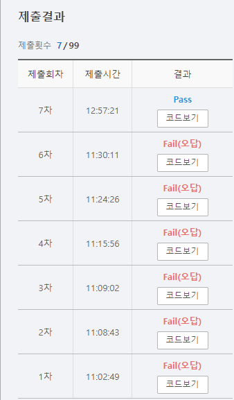

# SWEA 5207 이진 탐색

### 문제 

https://swexpertacademy.com/main/learn/course/subjectDetail.do?subjectId=AWUYFsQq11kDFAVT#

<hr>


### 풀이

1. 처음에 주어진 배열을 정렬(연습 삼아 병합 정렬을 진행해봄)
2. 이진 탐색을 시작하면 한 쪽이 두 번 연속 나온다면 종료
3. 이때 종료를 위해 flag를 두고 한쪽이 나오면 +1을 해주고 반대쪽이 나오는 순간 0으로 초기화 해줌
4. 같은 쪽이 2번 연속 반복하여 나온다면 +2가 되면서 함수를 종료시킴

<hr>


### 코드

```python
import sys
sys.stdin = open('input.txt')

#### 문제 이해
# 양 쪽을 번갈아 가면서 찾는 값까지 도달하면 1
# 양 쪽을 번갈아 가면서 찾는 값을 도달하지 못하거나 한 쪽을 두 번 진행하면 0

# 병합 정렬은 리스트를 계속해서 반으로 나누어서 더이상 나눌 수 없다면 다시 순차적으로 붙여서 정렬하는 방식
def merge(left, right):
    l_idx = r_idx = 0
    left_check = len(left)
    right_check = len(right)
    result = []
    while l_idx < left_check and r_idx < right_check:
        if left[l_idx] < right[r_idx]:
            result.append(left[l_idx])
            l_idx += 1
        else:
            result.append(right[r_idx])
            r_idx += 1
    if l_idx < left_check:
        result.extend(left[l_idx:])
    else:
        result.extend(right[r_idx:])
    return result

def merge_sort(N):
    if len(N) == 1:
        return N
    else:
        mid = len(N)//2
        left = N[mid:]
        right = N[:mid]

        left = merge_sort(left)
        right = merge_sort(right)

        result = merge(left, right)
        return result

# 1. 가운데 값을 기준으로 리스트를 둘로 나눈다.
# 2. 찾는 값이 가운데 값보다 크면 우측에서만 탐색, 작으면 좌측에서만 탐색을 반복

def bi_search(A, number):
    left = 0
    right = len(A)-1
    left_check = 0                  # 좌측이 한 번 나오면 1로 바뀜, 이후 우측이 나오면 다시 0으로 바뀜
    right_check = 0                 # 우측이 한 번 나오면 1로 바뀜, 이후 좌측이 나오면 다시 0으로 바뀜
    while left <= right:
        mid = (left + right) // 2

        if A[mid] == number:
            return 1

        elif A[mid] < number:       # 찾는 값이 우측에 있다면 right_check 를 1로 바꾸고 left_check은 0으로 변경
            right_check += 1
            if right_check ==2:     # 우측이 2번 연속 나왔다면 함수 종료
                return 0
            left_check = 0
            left = mid+1
        else:
            left_check += 1         # 찾는 값이 좌측에 있다면 left_check를 1로 바꾸고 right_check는 0으로 변경
            if left_check == 2:     # 좌측이 2번 연속 나왔다면 함수 종료
                return 0
            right_check = 0
            right = mid-1
    return 0


T = int(input())
for tc in range(T):
    N, M = map(int,input().split())
    A = list(map(int, input().split()))
    B = list(map(int, input().split()))
    A = merge_sort(A)
    cnt = 0
    for i in B:
        cnt += bi_search(A,i)
    print(f'#{tc+1} {cnt}')

```

<hr>


### 결과



처음에 문제에 대한 이해를 잘못하고 풀어서 계속해서 틀렸다. 값을 찾아가는 도중에 한 번이라도 한쪽으로 두 번 연속 이동하게 된다면 틀리게 되는 것이었는데 처음 2번 움직였을 때 왼쪽 또는 오른쪽이 2번 연속이라는 말로 이해를 하여 잘못풀었다. 문제를 잘 읽고 이해하자!