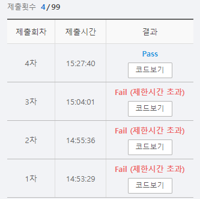

# SWEA 5208  전기버스2 (DP)


### 문제 

https://swexpertacademy.com/main/learn/course/subjectDetail.do?subjectId=AWUYGf7K180DFAVT#

<hr>


### 풀이

도착지부터 출발점까지 뒤에서부터 거꾸로 채워오며 최소 이동거리를 구하는 방식으로 풀이를 진행하였다. 이때 한 번 구한 값은 다시 계산하지 않도록 dp를 사용하였다. 맨마지막부터 한 칸씩 앞으로 당겨오며 각 정류장을 순회하는데 이떄 해당 정류장까지 앞에 정류장들이 도착할 수 있는지를 파악하고 도착할 수 있다면 최소값으로 갱신해주는 방식이다.

### 코드

```python
import sys
sys.stdin = open('input.txt')

T = int(input())
for tc in range(1):
    arr = list(map(int, input().split()))

    N =arr[0]                               # N: 정류장 수
    stop = arr[1:]                          # 충전지 용량

    dp = [N]*N                              # 정류장 수만큼 dp 생성, 각 요소는 나올 수 없는 큰 수인 N으로 초기화 0 < M < N
    dp[N-1] = 0                             # 기저 조건인 맨 마지막 값을 0으로 초기화
    for i in range(len(stop), -1, -1):      # 뒤에서부터 순회하면서 도착지에 도착할 수 있는 최소값으로 업데이트
        for j in range(i-1, -1,-1):
            print(f'i:{i} - j:{j}')
            print(f'stop : {stop}')
            print(f'dp : {dp}\n')
            if i <= j+stop[j]:              # j에서 i까지 올 수 있다면
                dp[j] = min(dp[i]+1, dp[j]) # dp[i]와, dp[j] 값을 비교해서 더 작은 값으로 초기화화
    print(f'#{tc+1} {dp[0]-1}')
```

<hr>


### 결과



DP를 사용하여 문제를 푼 경험이 적다보니 많은 시행착오가 있었다. 또한 이 문제의 의도가 사실 dp로 해결하기 보다는 너 백트래킹 할 수 있어?라고 묻는 문제였다. 따라서 백트래킹으로도 이 문제를 풀어보도록 해야겠다.