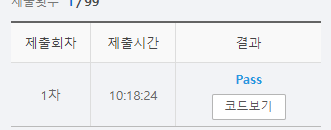

# SWEA 5248 그룹 나누기

### 문제 

https://swexpertacademy.com/main/learn/course/subjectDetail.do?subjectId=AWUYG3y62EcDFAVT#

<hr>


### 풀이

1. 인풋을 받으면 idx가 대표자가 되도록 설정
2. 관계를 보고 새로운 대표자를 설정하여 바꾸어줌
3. 대표자의 중복되지 않은 수를 세줌

<hr>


### 코드

```python
import sys
sys.stdin = open('input.txt')

# 대표자 찾으면 끝

def find_set(x):                        # 대표자 찾는 함수
    while x != rep[x]:                  # value와 idx 가 같을 때까지 반복
        x = rep[x]                      # value와 idx가 같지 않으면 해당 idx의 value를 다시 x에 할당
    return x

def union_set(x,y):                     # x의 대표자를 찾아서 y의 대표자로 바꾸어줌
    rep[find_set(y)] = find_set(x)
    return x

T = int(input())

for tc in range(T):
    N, M = map(int, input().split())
    arr = list(map(int, input().split()))

    rep = [i for i in range(N+1)]
    for i in range(M):
        union_set(arr[i*2],arr[i*2+1])                  # n2의 대표자를 n1의 대표자로 바꾸어줌

    header = set(map(lambda n: find_set(n), rep[1:]))   # rep의 각 대표자를 중복 제거하고 뽑음
    print(header)
    print(f'#{tc+1} {len(header)}')
```

<hr>


### 결과



대표자와 관련된 개념만 알고 있다면 편하게 풀 수 있는 문제이다.