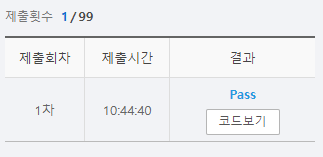

# SWEA 5249 최소 신장 트리

### 문제 

https://swexpertacademy.com/main/code/problem/problemSubmitHistory.do?contestProbId=AWngfZVa9XwDFAQU


### 풀이

1. 임의의 정점 하나를 선택해서 시작
2. 선택된 정점으로부터 가장 적은 비용이 드는 정점을 향해 출발
3. 위에 선택된 두 정점 중 가장 적은 비용이 드는 정점을 향해 다시 출발
4. 위 내용을 모든 정점을 방문할 때까지 반복 (MST가 가득찰 때까지)

<hr>


### 코드

```python
import sys
from pprint import pprint
sys.stdin = open('input.txt')

'''
최소 신장 트리 문제
구현 방법
1. prim1(우선 순위 Queue 안쓰고)    : 인접 행렬 쓰자
2. prim2    : 인접 행렬 쓰자
3. KRUSKAL  : 인접 리스트 쓰자
'''

'''
prim1
1. 임의의 정점 하나를 선택해서 시작
2. 선택된 정점으로부터 가장 적은 비용이 드는 정점을 향해 출발
3. 위에 선택된 두 정점 중 가장 적은 비용이 드는 정점을 향해 다시 출발
4. 위 내용을 모든 정점을 방문할 때까지 반복 (MST가 가득찰 때까지)
'''
def prim_1(r,N):
    mst = [0]*(N+1)
    key = [10000]*(N+1)
    key[r] = 0                                      # 초기 시작 정점 비용 0으로 선언
    for _ in range(N):
        mmin = 10000
        for i in range(N+1):                        # 가장 적은 비용이 드는 정점 찾기
            if mst[i] ==0 and key[i] < mmin:
                u = i
                mmin = key[i]
        mst[u] = 1

        for v in range(N+1):                        # 인접 정점 찾기
            if mst[v] == 0 and adjM[u][v] > 0:
                key[v] = min(key[v], adjM[u][v])
    return sum(key)


T = int(input())
for tc in range(T):
    N, M = map(int, input().split())
    adjM = [[0]*(N+1) for _ in range(N+1)]
    for _ in range(M):
        n1, n2, w = map(int,input().split())
        adjM[n1][n2] = w
        adjM[n2][n1] = w

    print(f'#{tc+1} {prim_1(0,N)}')
```

<hr>


### 결과



너 최소 신장 트리 구현 가능해? 라고 묻는 문제이다

구현 방법에는 prim에서도 두 가지가 가능하고 KRUSKAL 방식으로도 구현 가능하다.

아직까지는 prim에서도 한 가지 방법밖에 사용할 줄 모르니 두 가지 방법을 다 연습하도록 하자

