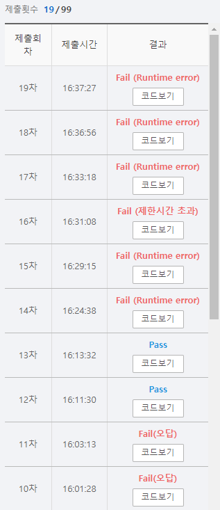

# SWEA 5250 최소 비용

### 문제 

https://swexpertacademy.com/main/learn/course/subjectDetail.do?subjectId=AWUYHO7a2JoDFAVT#

<hr>

### 풀이

1. value를 절대 나올 수 없는 최대값으로 초기화한 배열 생성(maps)
1. 주어진 배열을 순회하며 해당 idx에 해당하는 maps의 value를 최소값으로 초기화하며 이미 최소값이라면 해당 부분은 더이상 순회하지 않는다.
1. 계속해서 순회하며 마지막 값을 최소값으로 갱신해준다.

<hr>


### 코드

```python
import sys
from pprint import pprint
sys.stdin = open('input.txt')

'''
결국은  다 돌면서 최소 값으로 해당 칸을 업데이트해주고, 다음 칸이 지금 나보다 더 작다면 더이상 돌지 않는다.
'''
d = [(-1,0),(1,0),(0,-1),(0,1)]

def bfs(start):
    Q = [start]
    maps[start[0]][start[1]] = 0
    while Q:
        v = Q.pop(0)
        if v[0] ==N-1 and v[1] == N-1:
            continue
        for i in range(4):
            nr = v[0] + d[i][0]
            nc = v[1] + d[i][1]
            if 0 <= nr < N and 0 <= nc < N and maps[nr][nc] <= maps[N-1][N-1]:              #maps를 순회하며 다음 값이 현재값 + 가중치보다 크다면 최소값으로 갱신
                if arr[v[0]][v[1]] < arr[nr][nc]:
                    if maps[nr][nc] > maps[v[0]][v[1]]+arr[nr][nc]-arr[v[0]][v[1]]:
                        maps[nr][nc] = maps[v[0]][v[1]]+arr[nr][nc]-arr[v[0]][v[1]]+1
                        Q.append([nr,nc])
                else:
                    if maps[nr][nc] > maps[v[0]][v[1]]+1:
                        maps[nr][nc] = maps[v[0]][v[1]]+1
                        Q.append([nr, nc])


T = int(input())
for tc in range(T):
    N = int(input())
    arr = [list(map(int, input().split())) for _ in range(N)]
    start = [0,0]
    maps = [[10000000000000]*(N) for _ in range(N)]             # maps 를 절대 나올 수 없는 최대값으로 초기화
    bfs(start)
    print(f'#{tc+1} {maps[N-1][N-1]}')
```

<hr>


### 결과



무시무시무시한 제출 횟수....

처음에 문제를 잘못 파악하여 나보다 큰 값으로 이동할 때는 단순 cnt + 2 만 해주면 되는 줄 알았는데 알고보니 차이 만큼을 더 더해주는 것이었다. (똑바로 읽어라ㅡㅡ)

또 다른 문제는 초기에 배열을 초기화 할 때 넣어준 값이 너무 작은 값으로 넣어주어서 문제가 생겼다. 이 또한 문제를 제대로 읽지 않아서 일어난...

이후 실패는 bfs가 아닌 dfs로 재귀 호출을 하며 가지치기를 통해 해결해 보려고 했으나 잘되지 않았다. (언젠가는 완성하겟지..?)
