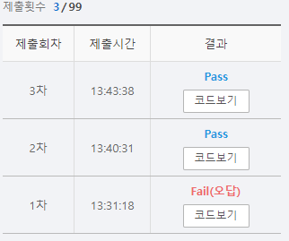

# SWEA 5648 원자 소멸 시뮬레이션

### 문제 

https://swexpertacademy.com/main/code/problem/problemDetail.do?contestProbId=AWXRFInKex8DFAUo

<hr>


### 풀이

1. 원자의 위치가 주어진 좌표의 범위를 벗어나면 고려하지 않음(해당 원자들은 이미 고려된 것으로 카운팅 후 제거)
2. 좌표를 0.5 씩 원자가 가진 방향으로 이동
3. set을 통해 모든 원자들의 좌표를 담아가다가 set에 추가했을 때 길이가 그대로면 해당 좌표가 충돌 좌표
4. 충돌 좌표를 energy_set에 저장
5. energy_set에 존재하는 좌표를 가진 원자들의 에너지를 방출시키고 제거
6. 주어진 배열에서 충돌 좌표에 위치한 원자와 좌표 범위를 넘어간 원자들을 제거하고 모든 원자가 고려될 때까지 반복 수행

<hr>


### 코드

```python
import sys
sys.stdin = open('input.txt')

def check_remove(arr):          # 주어진 좌표의 시작 값이 -1000에서 1000 사이, 이를 넘어가는 위치에 존재하면 충돌할 수 없음 따라서 해당 좌표를 넘어가면 해당 원자 제거
    if arr[2] == 0:
        if arr[1] == 1001:
            return True
    elif arr[2] == 1:
        if arr[1] == -1001:
            return True
    elif arr[2] == 2:
        if arr[0] == -1001:
            return True
    else:
        if arr[0] == 1001:
            return True
    return False

T = int(input())

# 0:상, 1:하, 2:좌, 3:우

d = [(0,0.5),(0,-0.5),(-0.5,0),(0.5,0)]                         # 0.5 칸씩 움직이도록 설정

for tc in range(T):
    N = int(input())
    arr = [list(map(int,input().split())) for _ in range(N)]

    cnt = 0                                                     # 처리된 원자의 수를 담을 변수 초기화
    energy = 0                                                  # 에너지 방출된 양을 담을 변수 초기화

    while cnt <N-1:                                               # 모든 원자의 수가 고려되면 반복 종료
        energy_sset =set()                                      # 충돌 좌표를 중복 제거해서 담을 set변수 생성
        sset=set()                                              # 모든 좌표를 중복 제거해서 담을 set변수 생성
        remove_list = []                                        # 제거되는 원자의 좌표를 담을 list 생성
        sset_cnt = 0                                            # set에 담은 원자의 수를 세기 위한 변수
        for i in arr:
            if not check_remove(i):                             # 원자가 충돌 가능 범위를 초과하지 않을 떄만 충돌에 대해 조사
                i[0],i[1] = i[0]+d[i[2]][0],i[1]+d[i[2]][1]     # 원자들의 좌표를 0.5씩 해당 방향으로 움직여줌
                sset.add((i[0],i[1]))                           # 원자들의 좌표를 sset이라는 변수에 중복 제거하며 담아줌
                sset_cnt += 1                                   # 원자들이 sset에 담길 때마다 몇 개가 들어갔는지 카운트
                if len(sset)!=sset_cnt:                         # sset에 크기와 들어간 수가 다르다면 이때 충돌이 일어남
                    energy_sset.add((i[0],i[1]))                # 충돌이 일어난 좌표를 energy_sset에 중복 제거하며 추가해줌
                    sset_cnt -= 1                               # 충돌 좌표를 파악했다면 다시 sset_cnt를 -1만큼 감소시킴
            else:
                cnt += 1                                        # 원자가 충돌 가능 범위를 초과했다면 고려한 원자 수를 1만큼 증가
                remove_list.append(i)                           # 이후 제거될 목록에 원자의 정보를 추가해줌
        for i in arr:                                           # 주어진 원자를 순회
            if (i[0],i[1]) in energy_sset:                      # 원자의 좌표가 energy_sset에 들어있다면
                energy += i[3]                                  # energy에 해당 원자의 에너지만큼 더해줌
                cnt += 1                                        # 이후 고려한 원자 수를 1만큼 증가
                remove_list.append(i)                           # 해당 원자는 파괴되었음으로 remove_list에 원자 정보 추가
        next_arr =[]                                            # 고려된 원자들을 제외하고 다시 순회를 돌기위해 아직 고려 가능한 원자들만 담을 리스트 생성
        for i in arr:                                           # 현재 주어진 배열을 순회
            if i not in remove_list:                            # 제거된 원자가 아니라면
                next_arr.append(i)                              # 다음 과정에서 순회할 리스트에 해당 원자 추가
        arr = next_arr                                          # arr 에 새로운 고려 대상들을 추가하고 while 다시 반복
    print(f'#{tc+1} {energy}')
```

<hr>


### 결과



코드를 짤 때 특정 알고리즘을 고려한 것이 아닌 해당 상황에 맞추어 처리해주기만 하였다. 

처음에 1차 시도에서 틀렸었는데 그 이유는 습관적으로 원자의 이동 1이라고 생각했기 때문이다. 하지만 문제를 다시 읽어보니 원자가 0.5 이동했을 때 충돌하는 것도 고려하였기에 해당 부분을 다시 처리해주었다. 