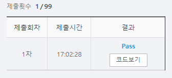

# SWEA 7465 창용 마을 무리의 개수

### 문제 

https://swexpertacademy.com/main/code/problem/problemSubmitHistory.do?contestProbId=AWngfZVa9XwDFAQU


### 풀이

1. 인풋을 받으면 idx가 대표자가 되도록 설정
2. 관계를 보고 새로운 대표자를 설정하여 바꾸어줌
3. 대표자의 중복되지 않은 수를 세줌

<hr>


### 코드

```python
import sys
sys.stdin = open('input.txt')

def find_set(x):                        # 대표자 찾는 함수
    while x != rep[x]:                  # value와 idx 가 같을 때까지 반복
        x = rep[x]                      # value와 idx가 같지 않으면 해당 idx의 value를 다시 x에 할당
    return x

def union_set(x,y):                     # x의 대표자를 찾아서 y의 대표자로 바꾸어줌
    rep[find_set(y)] = find_set(x)
    return x


T = int(input())

for tc in range(T):
    N, M = map(int, input().split())

    rep = list(range(N+1))
    for _ in range(M):
        n1, n2 = map(int,input().split())               # n2의 대표자를 n1의 대표자로 바꾸어줌
        union_set(n1,n2)

    header = set(map(lambda n: find_set(n), rep[1:]))   # rep의 각 대표자를 중복 제거하고 뽑음
    print(f'#{tc+1} {len(header)}')
```

<hr>


### 결과



easy